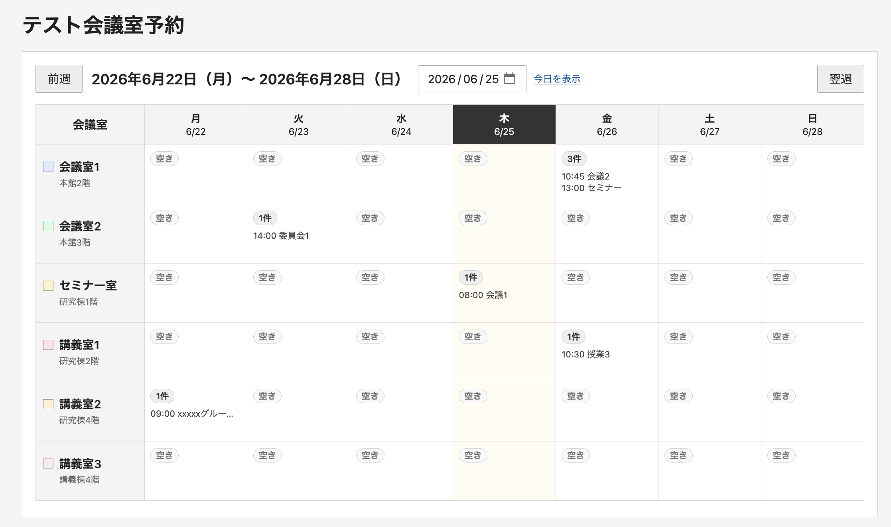

# Meeting Room Reservation System

PHPとSQLiteで動作する、シンプルな会議室予約システムです。
日ごとの予約状況を会議室ごとに確認でき、予約の登録・編集・削除、毎週予約、会議室設備情報の登録・閲覧を行えます。



## 主な機能

- 日ごとの会議室予約一覧
- 前日・翌日、前週・翌週への移動
- カレンダーによる日付選択
- 会議室名から予約登録
- 予約の登録、編集、削除
- 予約時間の重複チェック
- 毎週予約
- 毎週予約の1件のみ、または指定回以降の一括編集・削除
- 会議室ごとの自動配色
- 会議室の定員・設備・注意事項の登録と閲覧
- スマートフォン向け表示
- SQLiteデータベースへの直接アクセス防止用 `.htaccess`

## 動作環境

- Webサーバー
- PHP 7.4以上
- PDO
- PDO SQLite
- SQLite 3
- UTF-8を扱えるブラウザ

Apacheでの利用を想定しています。  
Nginxなどを使用する場合は、`data/` ディレクトリへの外部アクセスをWebサーバー側で拒否してください。

## ファイル構成

```text
meeting-room-reservation/
├── .gitignore
├── README.md
├── config.example.php
├── config.php
├── db.php
├── index.php
├── reserve.php
├── edit.php
├── delete.php
├── room.php
├── setup.php
├── setup-web.php
└── data/
    ├── .gitkeep
    └── .htaccess
```

初期設定後、`data/` に次のファイルが作成されます。

```text
data/reservation.sqlite
data/setup.lock
```

これらの実行時生成ファイルはGitへ登録しません。

## インストール

### 1. リポジトリを取得する

```bash
git clone https://github.com/maiko-tpc/room_book
```

ZIPで取得した場合は、展開したディレクトリへ移動してください。

### 2. 設定ファイルを作成する

配布用の設定例をコピーします。

```bash
cp config.example.php config.php
```

すでに `config.php` が含まれている配布物では、この操作は不要です。

### 3. 会議室を設定する

`config.php` の `$rooms` を編集します。

```php
$rooms = [
    [
        'id' => 'meeting_room_1',
        'name' => '会議室1',
        'description' => '本館2階',
    ],
    [
        'id' => 'meeting_room_2',
        'name' => '会議室2',
        'description' => '本館3階',
    ],
];
```

各項目の意味：

- `id`  
  システム内部で使用する識別子です。半角英数字とアンダースコアを推奨します。
- `name`  
  画面に表示する会議室名です。
- `description`  
  場所などの補足説明です。不要な場合は空文字にできます。

予約データを登録した後は、会議室の `id` を変更しないでください。  
`id` を変更すると、既存の予約や会議室詳細情報との対応が失われます。

### 4. `data` ディレクトリへ書き込み権限を設定する

WebサーバーのPHPが `data/` へ書き込める必要があります。

一般的な例：

```bash
chmod 775 data
```

共有サーバーなどで上記では書き込めない場合：

```bash
chmod 777 data
```

`777` は必要な場合だけ使用してください。所有者やグループを設定できる環境では、適切な所有権を設定する方が安全です。

### 5. 初期設定を実行する

#### ブラウザから実行する場合

ブラウザで `setup-web.php` を開きます。

```text
https://example.com/meeting-room-reservation/setup-web.php
```

画面の「初期設定を実行」ボタンを押してください。

完了すると、次が作成されます。

```text
data/reservation.sqlite
data/setup.lock
```

初期設定後は、サーバーから `setup-web.php` を削除してください。

```bash
rm setup-web.php
```

#### コマンドラインから実行する場合

PHP CLIが利用できる環境では、次を実行できます。

```bash
php setup.php
```

`setup.php` は既存の予約データを削除せず、不足しているテーブル・列・インデックスを追加します。

### 6. システムを開く

```text
https://example.com/meeting-room-reservation/
```

または、

```text
https://example.com/meeting-room-reservation/index.php
```

## 会議室詳細情報

予約一覧の「設備・詳細」から、各会議室の情報を確認できます。

登録できる項目：

- 定員
- スクリーン
- プロジェクター
- ホワイトボード
- Web会議設備
- その他の設備
- 注意事項・補足説明

通常は閲覧画面が表示され、「編集」ボタンを押した場合だけ編集フォームが表示されます。

## 毎週予約

予約登録画面で毎週予約を選び、繰り返し終了日を指定すると、開始日から7日ごとに予約を登録します。

毎週予約の途中の回を編集または削除する場合は、次の範囲を選択できます。

- この予約だけ
- この予約と、それ以降

対象期間内に既存予約との重複が1件でもある場合、毎週予約全体は登録されません。

## アクセス制限

このシステム自体には、利用者認証機能を備えていません。必要に応じて、Webサーバー側でアクセスを制限してください。

Apache 2.4で特定のネットワークだけ許可する例：

```apache
Options -Indexes

<RequireAny>
    Require ip 10.0.0.0/8
</RequireAny>
```

この設定は設置先のネットワーク構成に合わせて変更してください。  
`10.0.0.0/8` は一般的なプライベートアドレス範囲であり、特定組織専用ではありません。

## SQLiteファイルの保護

`data/.htaccess` には、次の設定を入れます。

```apache
Require all denied
```

Apache以外のWebサーバーでは `.htaccess` が無効なので、Webサーバー設定で `data/` へのアクセスを拒否してください。

設置後、ブラウザから次のようなURLへアクセスし、403になることを確認してください。

```text
https://example.com/meeting-room-reservation/data/reservation.sqlite
```

## バックアップ

予約データと会議室詳細情報は、次のSQLiteファイルに保存されます。

```text
data/reservation.sqlite
```

バックアップ例：

```bash
cp data/reservation.sqlite \
   data/reservation-backup-$(date +%Y%m%d-%H%M%S).sqlite
```

書き込み中のコピーを避けるため、利用者が少ない時間帯にバックアップしてください。

## 更新

更新前に、次をバックアップしてください。

```text
config.php
data/reservation.sqlite
```

プログラムを更新した後、必要に応じて次を実行します。

```bash
php setup.php
```

PHP CLIが利用できない場合は、一時的に `setup-web.php` を配置して実行し、完了後に削除してください。

## Gitで管理しないファイル

推奨する `.gitignore` の例：

```gitignore
# ローカル設定
config.php

# data内の実行時生成物
data/*

# 配布に必要なファイル
!data/.htaccess
!data/.gitkeep

# SQLite
*.sqlite
*.sqlite3
*.db
*.sqlite-journal
*.sqlite-wal
*.sqlite-shm

# ロック・ログ
*.lock
*.log

# OS・エディタ
.DS_Store
Thumbs.db
*.swp
*.swo
*~
.vscode/
.idea/

# 一時ファイル
*.bak
*.tmp
*.orig
```

`config.php` をGitへ含めない場合は、公開用の `config.example.php` を用意してください。

## トラブルシューティング

### `dataディレクトリに書き込み権限がありません`

```bash
chmod 775 data
```

共有サーバーで改善しない場合：

```bash
chmod 777 data
```

すでにSQLiteファイルが作成されている場合：

```bash
chmod 666 data/reservation.sqlite
```

### `PDO SQLite拡張が有効になっていません`

PHPでPDO SQLiteを有効にしてください。

コマンドラインで確認する場合：

```bash
php -m | grep -i sqlite
```

Web版PHPとCLI版PHPは設定が異なる場合があります。CLIで利用できなくても、Web版PHPでは利用できることがあります。

### 初期設定をやり直したい

まだ必要なデータがない場合だけ、次を削除します。

```bash
rm -f data/reservation.sqlite
rm -f data/reservation.sqlite-journal
rm -f data/reservation.sqlite-wal
rm -f data/reservation.sqlite-shm
rm -f data/setup.lock
```

その後、初期設定を再実行してください。

## セキュリティ上の注意

- `setup-web.php` は初期設定後に削除してください。
- `data/` へのWebアクセスを必ず拒否してください。
- インターネットへ公開する場合は、IP制限やBasic認証などを追加してください。
- HTTPSで運用してください。
- SQLiteデータベースをGitHubへ登録しないでください。
- 実在する会議室名や内部情報を公開したくない場合は、`config.php` をGit管理から除外してください。
